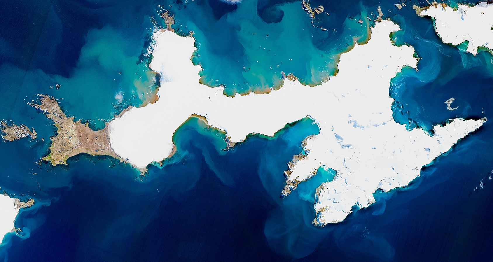

# 🌊 DICHOSOcean Intelligence Panel

<div align="center">


**An advanced data visualization and analysis platform for Antarctic oceanographic research**

[](https://streamlit.io/)
[](https://www.python.org/)
[](LICENSE)

[Live Demo](#-live-demo) • [Features](#-features) • [Quick Start](#-quick-start) • [Documentation](#-documentation)

</div>

---

## 📖 About

**DICHOSOcean** is a comprehensive web-based intelligence panel developed for the analysis and visualization of oceanographic data collected by biogeochemical sensors deployed in Deception Island, Antarctica as part of the DICHOSO research project (2024-2025).

The platform provides interactive dashboards for exploring complex oceanographic datasets, performing statistical analyses, and comparing interannual variability in key marine biogeochemical parameters.

### 🎯 Key Objectives

- **Visualize** high-frequency oceanographic time series data
- **Analyze** relationships between multiple biogeochemical variables
- **Compare** interannual variations between 2024 and 2025 Antarctic campaigns
- **Communicate** scientific findings through intuitive, interactive visualizations

---

## 🚀 Live Demo

🌐 **[Launch DICHOSOcean Panel](https://your-app-url.streamlit.app)** *(Coming Soon)*

<div align="center">
  
</div>

---

## ✨ Features

### 📊 **Data Overview Dashboard**
- **Interactive Data Table**: Browse raw oceanographic measurements
- **Variable Distribution Analysis**: Pie charts showing data completeness
- **Outlier Detection**: Box plots and statistical analysis using IQR method
- **Quantitative Metrics**: Outlier percentages for each measured variable

### 📈 **Statistical Analysis**
- **Correlation Matrix**: Pearson correlation coefficients between all variables
- **Significance Testing**: P-value heatmaps for statistical validation
- **Regression Analysis**: Scatter plots with best-fit lines for strongly correlated pairs (R² > 0.80)
- **Visual Insights**: Cool-to-warm color gradients indicating correlation strength

### 📅 **Interannual Variability**
- **2024 vs 2025 Comparison**: Side-by-side visualization of each variable
- **Distribution Analysis**: Box plots comparing statistical properties
- **Monthly Trends**: Seasonal pattern identification
- **Statistical Testing**: Mann-Whitney U test and t-tests for significance
- **Summary Tables**: Quantitative interannual change assessment

### 🐧 **DICHOSO Project Information**
- **Project Team**: Principal investigators and research staff
- **Scientific Objectives**: Research goals and hypotheses
- **Main Activities**: Fieldwork, laboratory analysis, modeling, and dissemination
- **Rich Media**: Photos and descriptions of project activities

### 📚 **Scientific References**
- Curated collection of relevant peer-reviewed publications
- Direct links to full-text articles
- DOI and citation information

---

## 🔬 Monitored Variables

The platform analyzes the following oceanographic parameters:

| Variable | Unit | Description |
|----------|------|-------------|
| **Temperature** | °C | Seawater temperature |
| **Pressure** | dbar | Water column pressure (proxy for depth) |
| **Salinity** | PSU | Practical Salinity Units |
| **Chlorophyll-a** | μg/L | Phytoplankton biomass indicator |
| **Turbidity** | NTU | Water clarity/suspended particles |
| **pH** | - | Seawater acidity |
| **Dissolved Oxygen** | μmol/kg | O₂ concentration |
| **pCO₂** | μatm | Partial pressure of CO₂ |
| **Total Alkalinity** | μeq/kg | Carbonate system parameter |

**Temporal Resolution**: 10-minute sampling interval
**Temporal Coverage**: January-February 2024 and 2025 (Antarctic summer)

---

## 🏗️ Architecture

```
dichosocean/
│
├── app.py                          # Main Streamlit application
├── requirements.txt                # Python dependencies
├── .gitignore                      # Git ignore rules
├── README.md                       # This file
│
├── data/                           # Oceanographic datasets
│   ├── dichosocean_prepared.csv    # Processed data (ready for analysis)
│   └── *.xlsx                      # Raw data files
│
├── resources/                      # Static assets
│   ├── *.png                       # Logo images
│   ├── *.jpg/*.jpeg                # Photos and graphics
│   ├── *.mp4                       # Video backgrounds
│   └── paper_*.png/jpg             # Reference paper thumbnails
│
└── notebooks/                      # Jupyter notebooks (data preparation)
    └── *.ipynb                     # Analysis and preprocessing scripts
```

### 🎨 Design Principles

- **Responsive Layout**: Wide-screen optimized with Streamlit's column system
- **Color Psychology**: Cool blues for low values, warm reds for high values
- **Data Integrity**: Outlier detection and removal with documented thresholds
- **Performance**: Cached data loading for fast re-renders
- **Accessibility**: Clear labels, high contrast, and intuitive navigation

---

## 🚀 Quick Start

### Prerequisites

- Python 3.12 or higher
- pip package manager
- Git

### Installation

1. **Clone the repository**
   ```bash
   git clone https://github.com/yourusername/dichosocean.git
   cd dichosocean
   ```

2. **Create and activate virtual environment**
   ```bash
   python -m venv venv
   source venv/bin/activate  # On Windows: venv\Scripts\activate
   ```

3. **Install dependencies**
   ```bash
   pip install -r requirements.txt
   ```

4. **Run the application**
   ```bash
   streamlit run app.py
   ```

5. **Open in browser**
   - The app will automatically open at `http://localhost:8501`
   - Or manually navigate to the displayed URL

### 🐳 Docker Support (Optional)

```dockerfile
FROM python:3.12-slim

WORKDIR /app

COPY requirements.txt .
RUN pip install --no-cache-dir -r requirements.txt

COPY . .

EXPOSE 8501

CMD ["streamlit", "run", "app.py", "--server.address", "0.0.0.0"]
```

Build and run:
```bash
docker build -t dichosocean .
docker run -p 8501:8501 dichosocean
```

---

## 📊 Data Preparation

The raw oceanographic data undergoes preprocessing before visualization:

1. **Column Standardization**: Rename columns to consistent format
2. **Datetime Conversion**: Parse timestamps to datetime objects
3. **Outlier Removal**:
   - **Chlorophyll-a**: Remove values > 200 μg/L
   - **Turbidity**: Remove values above 99th percentile
   - **Total Alkalinity**: Remove values < 2000 μeq/kg
4. **Quality Control**: Remove null values where appropriate

See `notebooks/` directory for detailed data preparation workflows.

---

## 🛠️ Technologies Used

| Technology | Purpose |
|------------|---------|
|  | Web application framework |
|  | Data manipulation and analysis |
|  | Numerical computing |
|  | Interactive visualizations |
|  | Statistical analysis |

---

## 📝 Usage Examples

### Exploring Data Distributions

1. Navigate to **"📈 Data Overview"**
2. Examine the pie chart showing data availability for each variable
3. Identify outliers using the box plot visualization
4. Check outlier percentages in the horizontal bar chart

### Finding Variable Correlations

1. Go to **"📊 Statistical Analysis"**
2. Inspect the correlation matrix heatmap
3. Check p-values for statistical significance
4. Explore scatter plots of the top 6 correlated pairs

### Comparing Years

1. Select **"📅 Interannual Variability"**
2. Review box plots, monthly trends, and histograms for each variable
3. Check the summary table for percentage changes
4. Identify statistically significant changes (Mann-Whitney U test, p < 0.05)

---

## 🤝 Contributing

Contributions are welcome! Please follow these steps:

1. Fork the repository
2. Create a feature branch (`git checkout -b feature/AmazingFeature`)
3. Commit your changes (`git commit -m 'Add some AmazingFeature'`)
4. Push to the branch (`git push origin feature/AmazingFeature`)
5. Open a Pull Request

### Development Guidelines

- Follow PEP 8 style guide for Python code
- Add docstrings to all functions
- Include comments for complex logic
- Test thoroughly before submitting PR
- Update documentation as needed

---

## 🐛 Troubleshooting

### Common Issues

**Issue**: `ModuleNotFoundError: No module named 'streamlit'`
**Solution**: Ensure virtual environment is activated and dependencies are installed:
```bash
source venv/bin/activate
pip install -r requirements.txt
```

**Issue**: Port 8501 already in use
**Solution**: Kill existing Streamlit process or specify different port:
```bash
streamlit run app.py --server.port 8502
```

**Issue**: Data file not found
**Solution**: Verify `data/dichosocean_prepared.csv` exists in the project directory

---

## 📚 Documentation

### Code Structure

The `app.py` file is organized into clear sections:

1. **Imports and Configuration**: Library imports and page setup
2. **Color Palettes**: UI and chart color definitions
3. **Data Loading**: Cached functions for efficient data loading
4. **Sidebar Navigation**: Menu and date range selector
5. **Section Routing**: Conditional rendering based on selected page
6. **Individual Dashboards**: Each dashboard section with visualizations

### Statistical Methods

- **Pearson Correlation**: Measures linear relationship strength (−1 to +1)
- **IQR Outlier Detection**: Values beyond Q1 − 1.5×IQR or Q3 + 1.5×IQR
- **Mann-Whitney U Test**: Non-parametric test for comparing distributions
- **Independent t-test**: Parametric test for comparing means

---

## 👨‍💻 Author

**Alejandro Román Vázquez**

- 🏢 **Institution**: ICMAN-CSIC (Instituto de Ciencias Marinas de Andalucía)
- 🔬 **ORCID**: [0000-0002-8868-9302](https://orcid.org/0000-0002-8868-9302)
- 💼 **LinkedIn**: [alejandro-román-vázquez](https://www.linkedin.com/in/alejandro-rom%C3%A1n-v%C3%A1zquez/)
- 🐙 **GitHub**: [@alrova96](https://github.com/alrova96)
- 📧 **Email**: a.roman@csic.es
- 🌐 **Website**: [alrova96.github.io](https://alrova96.github.io/)

---

## 🙏 Acknowledgments

This work is part of the **DICHOSO project** (Deception Island: CHemical Oceanography in the Southern Ocean), funded by the Spanish National Research Council (CSIC) and conducted aboard the R/V Hespérides during the 2024 and 2025 Antarctic campaigns.

**Principal Investigators:**
- Dr. I. Emma Huertas (ICMAN-CSIC)
- Dr. Antonio Tovar-Sánchez (ICMAN-CSIC)

---

## 📄 License

This project is licensed under the MIT License - see the [LICENSE](LICENSE) file for details.

---

## 📮 Citation

If you use this software in your research, please cite:

```bibtex
@software{dichosocean2025,
  author = {Román Vázquez, Alejandro},
  title = {DICHOSOcean Intelligence Panel: Interactive Analysis of Antarctic Oceanographic Data},
  year = {2025},
  publisher = {GitHub},
  url = {https://github.com/yourusername/dichosocean}
}
```

---

## 🔗 Related Publications

- **Belyaev et al. (2024)**. Hydrothermal alteration of seawater biogeochemistry in Deception Island. *Frontiers in Marine Science*. [DOI: 10.3389/fmars.2024.1432122](https://doi.org/10.3389/fmars.2024.1432122)

- **Henley et al. (2020)**. Changing Biogeochemistry of the Southern Ocean and Its Ecosystem Implications. *Frontiers in Marine Science*. [DOI: 10.3389/fmars.2020.00581](https://doi.org/10.3389/fmars.2020.00581)

---

<div align="center">

**⭐ Star this repository if you find it useful! ⭐**

Made with ❄️ for Antarctic oceanography research

</div>
